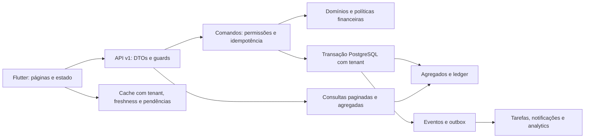

# Architecture & Product Gap Analysis — SysCredi

Data: 17/09/2026. Estado inicial frontend: `33d1473`. Backend: `../syscredi-backend`, incluindo alterações preexistentes não commitadas. O inventário complementar é [INVENTORY.md](INVENTORY.md). Este documento antecede as alterações estruturais desta evolução. Estado de execução em [DELIVERY.md](DELIVERY.md).

## 1. Executive Summary

**CURRENT STATE:** aplicação Flutter funcional de cadastro, pedidos, carteira e pagamentos, com API NestJS, PostgreSQL privado, Supabase Auth, idempotência no ciclo principal, snapshots contratuais e testes de integração. Há vários fluxos adicionais concentrados em controllers genéricos. O sistema é mais amplo do que o MVP descrito nos documentos antigos, mas a existência de tabelas e telas não equivale à conclusão dos módulos.

**TARGET STATE:** monólito modular transacional no servidor, cliente Flutter organizado por feature, instituição como fronteira de segurança, filiais como escopo operacional, dinheiro exato, workflows explícitos, planos e termos versionados, eventos transacionais e projeções para trabalho diário e analytics.

**GAPS:** isolamento referencial incompleto, inconsistência entre perfis, cache sem contexto de instituição explícito em todas as chaves, métricas calculadas sobre listas, regras em controllers, reversões sem alocações persistidas, ausência de workflow de reestruturação, aprovação sem snapshot de produto, ausência de tarefas/collateral/filiais completos e gestão documental principalmente de metadados.

**RISKS:** pagamento em moeda incompatível, mistura de moedas nos totais, transferência sem trilho financeiro completo, reestruturação destrutiva de prestações, idempotência parcial em comandos auxiliares, permissões desatualizadas dentro de certas transações, cross-tenant foreign keys, onboarding público com efeitos externos e recuperação parcial, migrações antigas com prefixos repetidos.

**RECOMMENDATIONS:** preservar as APIs v1 e comportamento validado; corrigir invariantes antes de expandir; introduzir módulos por corte vertical; extrair componentes Flutter sem trocar state management globalmente; publicar capacidades reais e estados de sincronização; nunca converter simplesmente todos os serviços em CRUD genérico.

**MIGRATION STRATEGY:** expandir → preencher/verificar → ativar novos comandos → migrar leitores → retirar compatibilidade apenas após evidência. Sem apagar bases, renomear migrations aplicadas ou recalcular contratos históricos. Migrações desta execução são preparadas e testadas em PostgreSQL isolado; a base de produção não é usada para testes.

## 2. Current Architecture Assessment

### Frontend

`main → SyscrediApp → RemoteRoot → connectRemote → SessionService → PremiumRemoteHome → Store → Home`. Material e Fluent coexistem. `ChangeNotifier` resolve boa parte da interação atual, mas `Store` reúne catálogos, tradução de DTOs, persistência e comandos. Diversas features são `part` da biblioteca da aplicação. `RemoteWorkspace` duplica uma experiência de navegação não selecionada pela raiz normal.

A API remota schema 18 concentra tabelas de negócio e preferências no servidor. Dados remotos transportam freshness, tenant e versão de forma explícita.

### Backend

O ciclo principal usa `CommandExecutor`, `UnitOfWork`, `PgLedgerRepository`, `CreditUseCases` e `TreasuryUseCases`. O executor revalida perfil, bloqueia a chave de idempotência e grava resposta na mesma transação. O domínio utiliza minor units e BigInt intermediário para juros. Há proteção de corpo, validação de DTO, guards, rate limit autenticado, TLS e request IDs.

`MatrixController`, `ParityController`, controllers de tesouraria e organizações também executam SQL e regras diretamente. Alguns verificam só a presença da chave, outros não vinculam replay à rota/entidade. A política descrita na arquitetura não se aplica uniformemente a esses caminhos.

### Banco

Schema `app` com RLS e papel `syscredi_api`; `organization_id` selecionado por transação. Tabelas de contratos, pagamentos, recibos e auditoria têm proteção contra alterações no papel runtime. Várias FKs usam apenas UUID, sem `organization_id`. Perfis permitem resolução antes de escolher tenant. O trigger de organização atual reatribui `organization_id` em UPDATE, o que precisa ser protegido especialmente nas tabelas de identidade.

### Fluxos reais a preservar

| Fluxo | Caminho e invariantes existentes |
| --- | --- |
| Pedido | DTO → executor → cliente/produto → pedido e auditoria. |
| Decisão | Versão otimista e sequência documentação/análise/comité/aprovado; motivo na recusa. |
| Desembolso | Pedido bloqueado, KYC válido, produto ativo, conta/moeda/saldo, prestações, snapshot, caixa, diário, auditoria. |
| Pagamento | Crédito/conta/prestações bloqueados, alocação capital primeiro em cada prestação, pagamento/recibo/caixa/diário. |
| Reversão | Controller altera prestações da última para a primeira; falta vínculo da alocação ao pagamento e lançamento inverso. |
| Reestruturação | Controller recebe snapshots, apaga prestações e redistribui pagos; falta autoridade sobre plano anterior e aprovação formal. |

## 3. Functional Gap Analysis

| Domínio | Atual | Alvo / lacuna |
| --- | --- | --- |
| Identity | Organizações, memberships e quatro papéis, um deles chamado guarantor | Filial, equipe, permissões por contexto, autoridade e maker-checker; avalista não deve implicitamente ser analista. |
| Customer | Indivíduos, empresas em cadastro separado, contactos básicos, perfil local, visitas, documentos, avalistas | Customer 360 remoto, relacionamento, finanças estruturadas, timeline, tarefas e exposição por moeda. |
| Products | Taxa anual, prazo, limite e moeda | Política financeira versionada, frequências, carência, tarifas, elegibilidade, documentação e aprovação. |
| Origination | Sequência de seis estados | Draft/submissão/documentação/análise/aprovação/contratação/desembolso e caminhos alternativos com histórico explícito. |
| Approval | Papel credit decide | Políticas por valor/produto/risco, votos, condições, separação de funções e limites. |
| Loan engine | Capital constante mensal | Estratégias determinísticas e contrato de arredondamento; backend autoritativo, simulação API. |
| Servicing | Pagamento parcial/integral, saldo agregado, ajuste e reversão | Componentes principal/juros/tarifas/multas, allocation ledger, excessos controlados, liquidação e write-off aprovados. O primeiro corte já persiste `payment_allocations`; reversão idempotente própria continua pendente. |
| Collections | Ações locais e visão de vencidos | Casos atribuídos, promessas, resultados e filas por DPD. |
| Collateral | Avalistas e anexos | Bens, proprietário, avaliação, vínculo, LTV, inspeção e liberação. |
| Risk | Score simples e pesos configuráveis | Modelo/versionamento, fatores explicáveis, affordability, override justificado. |
| Compliance | KYC por validade e alertas AML | Casos, checklist, decisões e providers explicitamente não configurados. |
| Treasury | Contas, pagamentos, transferências e depósitos | Coerência de caixa/diário, moeda, caixas físicos, posição e pendências. |
| Accounting | Diário JSON e serviço local mais estruturado | Posting rules, linhas normalizadas, eventos, moeda, períodos e reconciliação com subledger. |
| Reconciliation | Comparação de saldo remota; extrato e matching locais | Extratos remotos versionados, duplicados, matching proposto/manual, divergências. |
| Documents | PDFs e metadados | Versões, expiração, propriedade, upload real validado; metadados não comprovam upload. |
| Intelligence | Dashboard básico backend; painel rico local | Agregação servidor, períodos, moeda, PAR, aging, pipeline, tarefas e drill-down. |
| Scale | Organizações | Filiais, equipes, notificações internas, outbox, observabilidade e flags. |

## 4. Technical Debt Map

| Prioridade | Evidência | Impacto | Ação |
| --- | --- | --- | --- |
| P0 | `TreasuryUseCases.receive` não compara moedas | Conta pode receber valor em unidade incompatível | Validar no domínio e banco; regressão antes da correção. |
| P0 | `MatrixController.transfer` não confirma destino ativo/moeda nem regista caixa/diário | Saldo sem trilho completo | Comando transacional central, locks ordenados e eventos. |
| P0 | `reversePayment` retira das últimas prestações | Reversão pode desfazer alocação de outro pagamento | Persistir alocações; migrar histórico deterministicamente e proteger legados ambíguos. |
| P0 | FKs por UUID e trigger reatribuidor | Relações atravessam instituições ou movem dados | FKs compostas e organização imutável, com verificação anterior. |
| P0 | Ajuste recebe anterior do cliente e apaga plano | História financeira perdida | Plano versionado, snapshot anterior do servidor e workflow aprovado. |
| P0 | `/dashboard` soma moedas; PAR local divide pela exposição original | Indicadores incorretos | Projeções por moeda e denominadores documentados. |
| P1 | Termos do produto relidos no desembolso | Condições aprovadas mudam entre decisão e contrato | Snapshot no pedido aprovado e migração explícita de aprovados legados. |
| P1 | Perfil revalidado só no executor principal | Revogação concorrente inconsistente | Envelope de comando partilhado para mutações. |
| P1 | `Store`, `premium.dart`, `RemoteWorkspace` grandes | Mudanças transversais e features duplicadas | Extrair read models, navegação e páginas independentes gradualmente. |
| P1 | Sincronização completa no arranque | Abertura lenta, memória e pedidos excessivos | Shell imediato; leituras paginadas por feature; métricas remotas. |
| P1 | Erros interpolados diretamente em widgets | Mensagens técnicas e exposição acidental | Mapeamento de erros comum e correlation ID. |
| P2 | Prefixos 007/008 repetidos | Ordem histórica frágil | Manter nomes aplicados; novas migrations unívocas sequenciais. |
| P2 | Documentos usam condições parcialmente reconstruídas | Divergência jurídica/operacional | Snapshot versionado como fonte para todos os renderers. |

## 5. Target Architecture

Monólito modular NestJS/PostgreSQL. Não introduzir microserviços antes de existir necessidade de escala independente. Cada módulo possui domínio, casos de uso, infraestrutura e API apenas quando essas camadas têm responsabilidades reais.

Manter ChangeNotifier onde é suficiente. Nova feature não entra como `part` de `syscredi_app.dart`. O domínio Flutter não calcula saldo remoto nem aprova operações financeiras. APIs antigas podem delegar a novos casos de uso mantendo o contrato.

## 6. Proposed Domain Model / Entity Map

| Bounded context | Agregados e entidades | Invariantes |
| --- | --- | --- |
| Identity | Institution, Branch, Team, UserMembership, Role, Permission, ApprovalAuthority | Instituição imutável, membership ativo, escopo permitido. |
| Customer | Customer, Individual/BusinessProfile, Address, Contact, FinancialProfile, Relationship, Interaction, DocumentReference | Identidade única por instituição; finanças datadas e moeda explícita. |
| Product | CreditProduct, ProductVersion, CalculationPolicy, EligibilityPolicy, ApprovalPolicy | Versão publicada imutável; produto não modifica contrato ativo. |
| Origination | LoanApplication, Applicant, Checklist, FinancialSnapshot, Assessment, Approval, StatusHistory | Somente transições permitidas; decisão identifica dados/modelo/política utilizados. |
| Collateral | Collateral, Ownership, Valuation, Pledge, Inspection, Release | Avaliação datada, vínculo aprovado, sem liberar bem comprometido indevidamente. |
| Servicing | Loan, TermsSnapshot, ScheduleVersion, Installment, Payment, Allocation, Charge, Settlement, Restructure, WriteOff | Conservação de valor, saldo derivável, replay seguro, histórico imutável. |
| Collections | CollectionCase, Assignment, Action, PromiseToPay | Próxima ação/responsável explícitos; promessa não altera dívida. |
| Finance | CashAccount, Transfer, CashMovement, PostingRule, JournalEntry, JournalLine, AccountingPeriod | Mesma moeda, débitos=créditos, origem única, período válido. |
| Compliance | KycCase, AmlCase, ScreeningResult, Review, Decision | Provider/versão/origem explícitos; revisão manual não é screening externo. |
| Work | Task, Notification, DomainEvent, OutboxDelivery | Criação idempotente por evento, sem entrega externa fictícia. |
| Analytics | PortfolioSnapshot, DashboardProjection, ReportDefinition | Métrica/versionamento/período/moeda/escopo reproduzíveis. |

Vocabulário: Customer=cliente; CreditProduct=produto; LoanApplication=pedido; Loan=obrigação desembolsada; LoanContract=termos jurídicos; Installment=prestação; Payment=pagamento; Disbursement=desembolso. `credit_requests` mantém-se como tabela legada até migração compatível, sem renomeação cosmética imediata.

## 7. Proposed Database Model / Database Map

Manter raízes existentes (`clients`, `products`, `credit_requests`, `loans`, `accounts`). Expandir por tabelas próprias: `branches`, `user_branches`, `application_history`, `approval_policies`, `approval_decisions`, `customer_financial_profiles`, `customer_interactions`, `collateral`, `collateral_valuations`, `loan_collateral`, `schedule_versions`, `payment_allocations`, `loan_charges`, `restructure_requests`, `collection_cases`, `collection_actions`, `promises_to_pay`, `tasks`, `notifications`, `domain_events`, `outbox_deliveries`, `document_versions`, `journal_lines`, `posting_rules`.

Cada entidade tenant-owned leva `organization_id NOT NULL`, índice para consultas reais e FKs `(organization_id, related_id)`. Valores monetários: bigint minor units, moeda ISO; taxas em basis points ou racionais explícitos. UUID é chave técnica; referência humana é única por instituição/tipo e gerada no servidor, nunca `count()+1`.

Contratos, eventos, alocações originais e planos históricos não são editáveis pelo runtime comum. Correção produz registo compensatório. Defaults para campos novos devem preservar semântica legada, não inventar aprovação ou assinatura.

## 8. Proposed API Structure / API Map

Compatibilidade: endpoints existentes permanecem disponíveis enquanto leitores são migrados. Comandos explícitos usam `Idempotency-Key`, versão esperada e payload validado. Listagens limitadas no servidor; detalhes 360 são consultas próprias, não composição de toda a carteira no dispositivo.

| Contexto | Rotas alvo |
| --- | --- |
| Customers | `/customers`, `/:id/overview`, `/:id/timeline`, `/:id/financial-profile`, `/:id/interactions` |
| Products | `/products`, `/:id/versions`, `/simulations` |
| Origination | `/applications`, `/:id/submit`, `/:id/transition`, `/:id/approvals`, `/:id/contract` |
| Servicing | `/loans`, `/:id/overview`, `/:id/schedule`, `/:id/payments`, `/:id/settlement-quote`, `/:id/restructures` |
| Payments | `/payments/:id/reverse`, `/:id/allocations` |
| Collateral | `/collateral`, `/:id/valuations`, `/:id/pledges`, `/:id/release` |
| Work | `/work/summary`, `/tasks`, `/notifications`, `/collections/cases`, `/collections/promises` |
| Finance | `/accounts`, `/account-transfers`, `/reconciliation/statements`, `/accounting/journal`, `/accounting/periods` |
| Analytics | `/analytics/overview`, `/analytics/aging`, `/analytics/pipeline`, `/reports/*`, `/search` |
| Administration | `/branches`, `/roles`, `/approval-policies`, `/integrations/capabilities`, `/settings/*` |

Erros padronizados: `code`, mensagem segura, `requestId`; distinguir validação, 401, 403, conflito, indisponibilidade e pendência de confirmação.

## 9. Proposed Navigation Architecture / Navigation Map

Visão geral → Meu trabalho → Clientes → Crédito (Pedidos, Carteira, Produtos, Aprovações) → Cobranças → Risco e conformidade → Tesouraria → Contabilidade → Relatórios → Administração.

Customer 360 liga pedidos, créditos, pagamentos, garantias e timeline. Loan 360 liga cliente, prestações, pagamentos, documentos, garantias, cobrança, contabilidade e auditoria. Seleção de filtros deve sobreviver à navegação de ida/volta. Mobile prioriza tarefas, clientes, recebimentos e visitas; desktop usa tabelas e painéis de detalhe. Nenhuma nova entrada vazia é exibida como módulo concluído.

## 10. Dashboard Specification

Três zonas: **Desempenho**, **Atenção**, **Trabalho**. A consulta recebe instituição da sessão, filial autorizada, moeda, data de referência e intervalo. Resposta inclui `asOf`, `currency`, `metricVersion` e freshness. Moedas diferentes não são somadas. Ausência de dados históricos produz comparação indisponível, não crescimento zero inventado.

| KPI | Definição |
| --- | --- |
| Carteira ativa | Quantidade de créditos com capital/obrigações remanescentes, excluindo créditos encerrados conforme estado. |
| Capital em carteira | Soma de principal ainda não pago; separado do saldo contratual com juros. |
| Desembolsado | Principal efetivamente desembolsado no intervalo `[from,to)`. |
| Recebido | Pagamentos no intervalo, com reversões tratadas explicitamente e sem dupla contagem. |
| Montante vencido | Componentes não pagos de prestações anteriores à data de referência. |
| DPD | Dias desde a prestação mais antiga vencida e não totalmente paga; zero quando não existe. |
| PAR30/60/90 | Principal remanescente de créditos com DPD maior que 30/60/90 dividido por principal remanescente total. Denominador zero → zero, com carteira vazia identificada. |
| Aging | Current, 1–7, 8–30, 31–60, 61–90, 91–180, 181+; contagem e capital por bucket. |
| Taxa de cobrança | Montante alocado às obrigações do período / montante exigível do mesmo conjunto de obrigações; antecipações separadas. |
| Aprovação | Aprovados / decisões aprovadas+recusadas no período, não aprovados / todos os pedidos. |
| Tempo até decisão | Diferença entre submissão e decisão terminal, a partir do histórico; não inferir se datas faltarem. |

Convenção PAR alinhada à definição de capital pendente em risco publicada pela [CGAP](https://www.cgap.org/sites/default/files/researches/documents/CGAP-Technical-Guide-Measuring-Results-of-Microfinance-Institutions-Minimum-Indicators-That-Donors-and-Investors-Should-Track-Jul-2009.pdf). Limites >30 e buckets 31–60 são intencionais e devem constar do contrato de métricas.

Gráficos de aging, evolução e pipeline são agregados no servidor; clique abre a consulta filtrada correspondente. Action Center apresenta contagens e links para aprovações, KYC, prestações, promessas e reconciliação. Gestor vê operação; analista vê pedidos; operador vê recebimentos/clientes; cobrança vê casos; financeiro vê caixa/diário. Os papéis só são disponibilizados após autorização real existir.

## 11. Design System Proposal

Preservar personalização institucional e preferência expressa do utilizador: cards arredondados, raio 20, cores derivadas do tema anterior; não reintroduzir branco/castanho fixos. Tokens: colorScheme semântico, tipografia, spacing 4/8/12/16/24/32, radius 8/12/20, elevação discreta, motion 167/250 ms.

Extrair `PageHeader`, `MetricCard`, `StatusBadge`, `MoneyText`, `FilterBar`, `EntityHeader`, `Timeline`, `AsyncState`, `ActionMenu` e tabela paginada. Componentes recebem dados e callbacks, não executam SQL nem decidem crédito. Estados obrigatórios: loading, vazio, erro, proibido, desatualizado, pendente e confirmado. Ações financeiras não exibem sucesso antes da confirmação remota.

## 12. Security Review

Modelo de ameaça: operador malicioso, utilizador revogado, troca de tenant durante pedido, repetição/reordenação de comandos, IDOR por UUID conhecido, app adulterado, falha de rede após commit e acesso indevido a documentos/cache.

RLS protege linhas, mas verificações de integridade referencial podem ultrapassá-la; por isso FKs compostas são necessárias para relações entre tenants ([PostgreSQL 17](https://www.postgresql.org/docs/17/ddl-rowsecurity.html)). Runtime sem superuser/BYPASSRLS; administração de schema separada. Resolver identidade antes do tenant não autoriza enumeração de perfis entre instituições.

Revalidar membership/autoridade na transação; chaves de replay vinculadas a utilizador, instituição, comando e entidade. Não registar payloads pessoais ou tokens em logs. Propagar requestId para eventos/auditoria. Upload futuro exige MIME real, tamanho, propriedade, checksum e políticas de storage; apenas guardar `storage_key` não satisfaz isso.

Fluxo público de onboarding necessita rate limit próprio, idempotência que cubra criação externa e resposta sem retenção indefinida de refresh token. Secret-store do Flutter precisa escopo por instituição e utilizador; trocar instituição invalida projeções e não reaproveita resposta de `/me` como autorização atual. Nenhum provider financeiro é considerado integrado por ter enum ou configuração.

## 13. Data Migration Strategy

1. Guardar inventário e testes de baseline. Backend sujo é preservado como trabalho anterior, sem reset.
2. Aplicar novas migrations somente na base local dedicada `syscredi_test`; nunca usar a URL operacional em testes destrutivos.
3. Antes de FKs compostas, verificar relações cruzadas. Se houver inconsistência, falhar com diagnóstico agregado sem PII; não mover dados silenciosamente.
4. Adicionar versões e componentes monetários; preencher alocações históricas só quando reconstrução é inequívoca. Dados ambíguos exigem estado de revisão, não números inventados.
5. Backfill de termos aprovados registra origem legada e data da migração; contratos já emitidos mantêm snapshot original.
6. Manter endpoints/campos antigos durante transição. Novas features anunciam capacidade; UI não assume servidor atualizado.
7. Rollback de código preserva colunas/tabelas novas; não executar down destrutivo sobre dados financeiros. Preferir forward fix.
8. Critérios de reconciliação: principal, saldo, total de alocações, pagamentos líquidos, caixa e débitos/créditos conservados por instituição/moeda.

## 14. Testing Strategy

Baseline executada: **90 testes Flutter e 31 backend passaram**, incluindo PostgreSQL 17 isolado no container `syscredi-evolution-test`, porta localhost 55439. Node disponível é 23.8.0, enquanto package.json pede 24.x; registar diferença e validar runtime-alvo quando disponível.

Adicionar regressões antes de alterar fórmulas: arredondamento, fim de mês, overflow, invariantes de capital/juros e conservação. Aplicação: workflow, maker-checker, saldo insuficiente, moeda, dupla submissão. Infraestrutura: RLS, foreign keys tenant, bloqueios, rollback, alocação/reversão, outbox e backfill. API: schema/DTO, 401/403, IDs de outros tenants, replay mesma/diferente operação. Flutter: estado assíncrono, navegação, filtros, permissões, tema e responsividade.

Cada corte passa análise estática e testes relevantes; suíte completa nos marcos. Não usar mocks permanentes nem desligar testes. Integração com providers externos permanece não verificada até credenciais e ambiente específicos existirem.

## 15. Refactoring Roadmap

| Fase | Entrega verificável | Gate |
| --- | --- | --- |
| 0 Discovery | Análise, mapas, baseline e backlog | Artefactos escritos antes de refatoração estrutural. |
| 1 Foundation | Dinheiro, tenant, comandos, auditoria/eventos, erros, tokens visuais | Regressões financeiras e isolamento passam. |
| 2 Core Credit | Motor/versionamento, Customer 360, originação e aprovação | Simular → decidir → desembolsar preserva termos e autorização. |
| 3 Servicing | Allocation ledger, reversões, cobranças, reestruturação e liquidação | Cenários parciais/concorrentes e histórico preservado. |
| 4 Finance | Transferências, postings e reconciliação | Caixa/subledger/diário conciliáveis por moeda. |
| 5 Intelligence | Dashboard remoto, métricas, risco e relatórios | Nenhum KPI institucional depende da carteira inteira no app. |
| 6 Scale | Filiais, tarefas, notificações, providers e observabilidade | Isolamento por filial/perfil, estados de entrega verdadeiros. |

## 16. Prioritized Backlog

| ID | Prioridade | Resultado esperado |
| --- | --- | --- |
| FND-01 | P0 | Bloquear recebimento e transferência entre moedas; validar contas e efeitos financeiros. |
| FND-02 | P0 | Relações tenant-safe, organização imutável e testes de ataques cross-tenant. |
| FND-03 | P0 | Envelope idempotente comum com revalidação, audit e eventos na transação. |
| SRV-01 | P0 | Alocações exatas por pagamento, reversão idempotente e posting inverso. |
| SRV-02 | P0 | Reestruturação sem apagar histórico nem aceitar saldo/snapshot anterior do cliente. |
| ANA-01 | P0 | Métricas por moeda, capital distinto de juros, PAR com definição correta. |
| FND-04 | P1 | Erros seguros, freshness, cache por instituição e cancelamento/timeout de abertura. |
| CRD-01 | P1 | Motor determinístico central e simulação remota com estratégias e testes. |
| CRD-02 | P1 | Versões de produto, snapshot aprovado, workflow e approval authority. |
| CRM-01 | P1 | Customer 360, finanças, relacionamentos e timeline unificada. |
| SRV-03 | P1 | Loan 360, componentes de dívida, liquidação e cobrança com promessas. |
| FIN-01 | P1 | Posting rules e períodos; operações manuais com trilho completo. |
| UX-01 | P1 | Navegação modular, Meu Trabalho, design tokens e tabelas paginadas. |
| SEC-01 | P1 | Onboarding público, dados de sessão, documentos e provider capabilities. |
| RSK-01 | P2 | Scoring explicável/versionado, affordability, KYC/AML cases. |
| COL-01 | P2 | Collateral, avaliações, LTV, garantias e liberação. |
| FIN-02 | P2 | Extratos, normalização, matching e diferenças. |
| ANA-02 | P2 | Períodos comparáveis, drill-down, relatórios e analytics. |
| SCL-01 | P2 | Filiais, equipes e permissões contextuais. |
| SCL-02 | P2 | Tasks, notifications internas e outbox com consumidores idempotentes. |
| EXP-01 | P3 | Grupos, revolving/linhas de crédito e produtos especializados quando houver regras completas. |
| EXP-02 | P3 | Providers externos reais, canais de mensagem e captura mobile por plataforma. |

Uma linha só passa para concluída com código, autorização, persistência, teste e UI quando aplicável. Flags e interfaces não contam como uma integração externa concluída.
